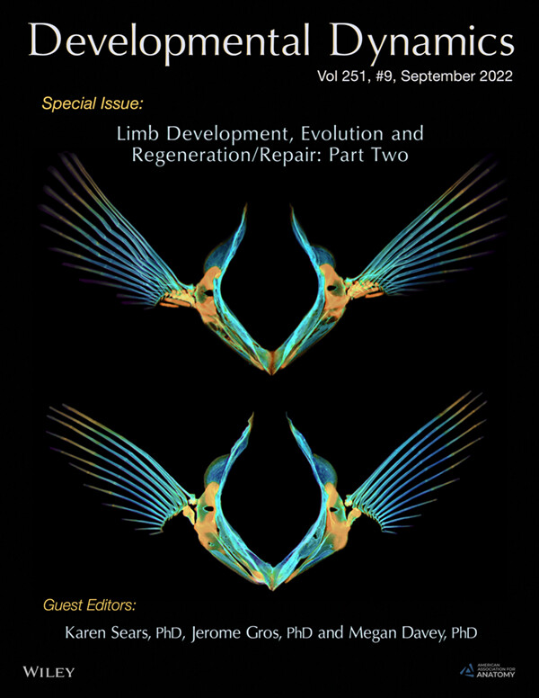

(* indicates equal contribution)

**2023**

**Leyhr J**, Haitina T, Bird NC. (preprint) Hidden in plain sight: does the first intercostal ligament help to
stabilize the Weberian apparatus? [bioRxiv](https://www.biorxiv.org/content/10.1101/2023.11.20.567829v1)

**Leyhr J**, Sanchez S, Dollman KN, Tafforeau P, Haitina T. (2023). Enhanced contrast
synchrotron X-ray microtomography for describing skeleton-associated soft tissue defects in
zebrafish mutants. [*Frontiers in Endocrinology*](https://www.frontiersin.org/articles/10.3389/fendo.2023.1108916/full)

**2022**

**Leyhr J**\*, Waldmann L\*, Filipek-Górniok B, Zhang H, Allalou A, Haitina T. (2022). A novel
cis-regulatory element drives early expression of Nkx3.2 in the gnathostome primary jaw joint.
[*eLife*](https://elifesciences.org/articles/75749)

 Waldmann L\*, **Leyhr J**\*, Zhang H, Allalou A, Öhman-Mägi C, Haitina T. (2022). The Role of Gdf5 in the Development of the Zebrafish Fin Endoskeleton. [*Developmental Dynamics*](https://anatomypubs.onlinelibrary.wiley.com/doi/full/10.1002/dvdy.399)

**2021**

Waldmann L\*, **Leyhr J**\*, Zhang H, Öhman-Mägi C, Allalou A, Haitina T. (2021). The Broad
Role of Nkx3.2 in the Development of the Zebrafish Axial Skeleton. [*PLoS ONE*](https://journals.plos.org/plosone/article?id=10.1371/journal.pone.0255953)

**2018**

Janssen R, Andersson E, Betnér E, Bijl S, Fowler W, Höök L, **Leyhr J**, Landström E,
Mannelqvist A, Panara V, Smith K, Tiemann S. (2018). Embryonic expression patterns and
phylogenetic analysis of panarthropod sox genes: Insight into nervous system development,
segmentation and gonadogenesis. [BMC Evolutionary Biology](https://bmcecolevol.biomedcentral.com/articles/10.1186/s12862-018-1196-z)

<ul class="image-list">
  <li>
    
    

      

        Waldmann L*, <strong>Leyhr J</strong>*, Zhang H, Allalou A, Öhman-Mägi C, Haitina T. (2022). The Role of Gdf5 in the Development of the Zebrafish Fin Endoskeleton. <a href="[https://example.com](https://anatomypubs.onlinelibrary.wiley.com/doi/full/10.1002/dvdy.399)"><i>Developmental Dynamics</i></a> 
      

    

  </li>
  <li>
    
    

      
Text vertically aligned with Image 2

    

  </li>
  <!-- Add more list items as needed -->
</ul>
